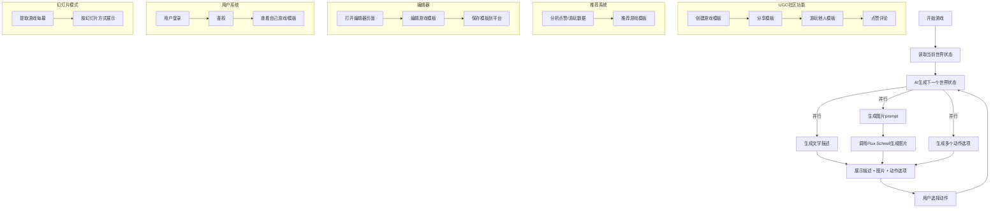

# Flow Chart

```mermaid
flowchart TD
    Start[开始游戏] --> S1[读取当前世界状态]
    S1 --> AIDecision[AI生成下一个世界状态]
    AIDecision -->|并行| TextGen[生成文字描述]
    AIDecision -->|并行| ImgPrompt[生成图片prompt]
    ImgPrompt --> ImgGen[调用Flux Schnell生成图片]
    AIDecision -->|并行| OptionsGen[生成多个动作选项]
    TextGen --> Display[展示描述 + 图片 + 动作选项]
    ImgGen --> Display
    OptionsGen --> Display
    Display --> PlayerChoice[用户选择动作]
    PlayerChoice --> AIDecision

    subgraph UGC社区功能
        CreateTemplate[创建游戏模板]
        ShareTemplate[分享模板]
        PlayTemplate[游玩他人模板]
        CommentLike[点赞评论]
        CreateTemplate --> ShareTemplate --> PlayTemplate --> CommentLike
    end

    subgraph 推荐系统
        Analyze[分析点赞/游玩数据]
        Recommend[推荐游戏模板]
        Analyze --> Recommend
    end

    subgraph 编辑器
        OpenEditor[打开编辑器页面]
        EditTemplate[编辑游戏模板]
        SaveTemplate[保存模板到平台]
        OpenEditor --> EditTemplate --> SaveTemplate
    end

    subgraph 用户系统
        Login[用户登录]
        AuthCheck[鉴权]
        ViewOwnData[查看自己游戏/模板]
        Login --> AuthCheck --> ViewOwnData
    end

    subgraph 幻灯片模式
        ExtractScenes[提取游戏每幕]
        ShowSlides[按幻灯片方式展示]
        ExtractScenes --> ShowSlides
    end
```
